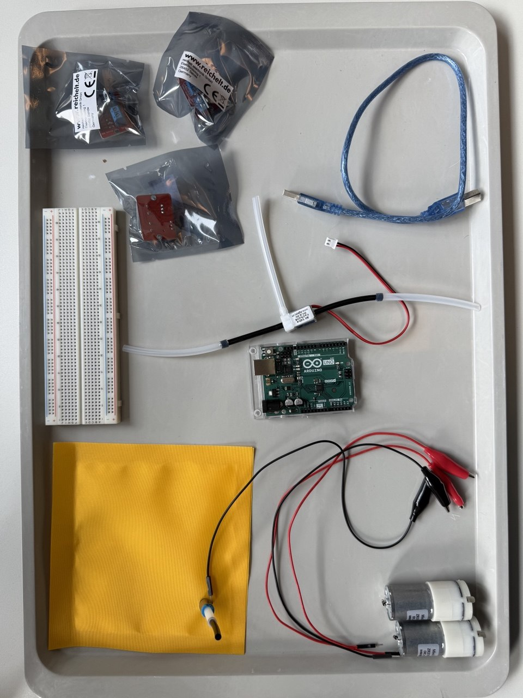

Exercise3 
# Pneumatic Stress Pillow

## Components Overview

- Arduino Uno

- Breadboard

- 2x Air Pumps

- Air Valve

- 3x MOSFET Modules

- Silicone Tubes

- Force-Sensitive Sensor

- Inflatable Pillow

- USB Cable

- Alligator Clips

