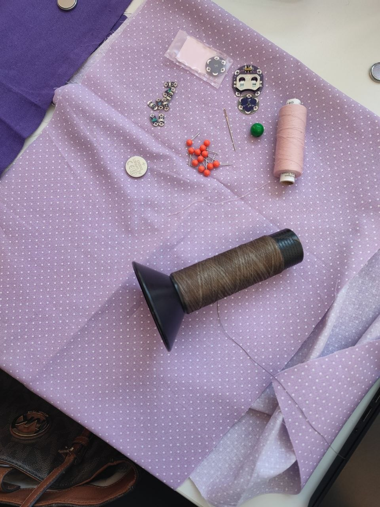
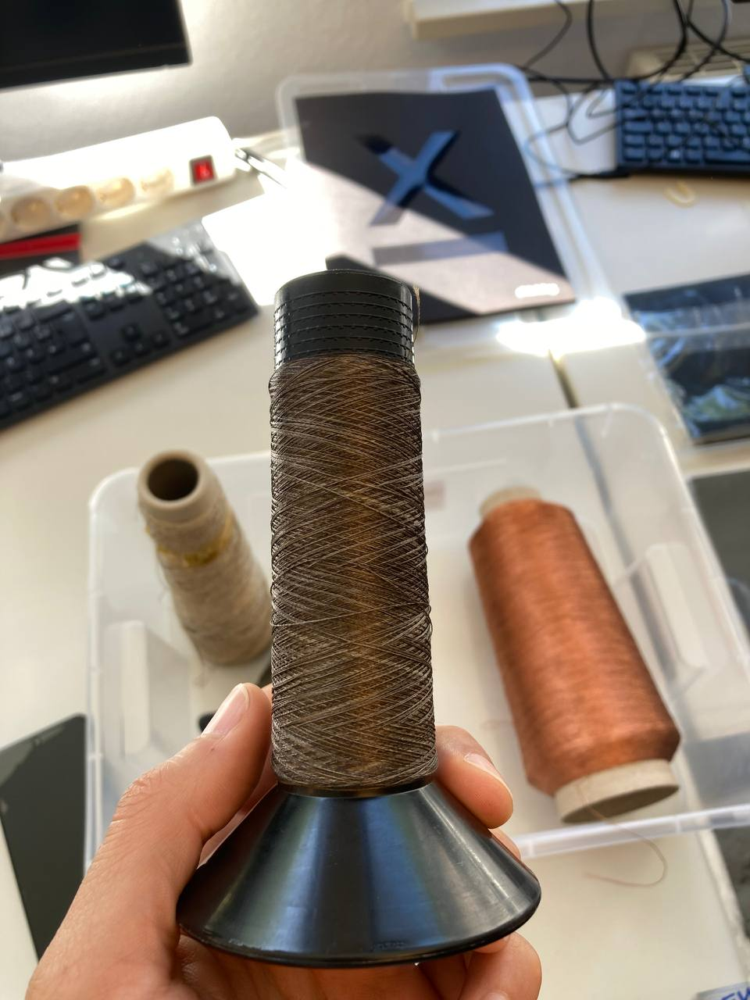
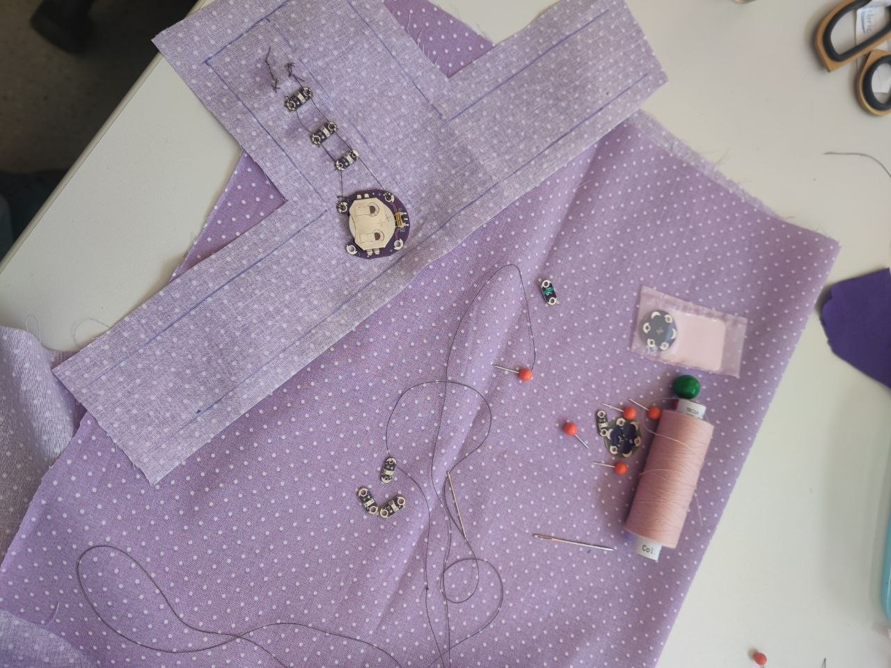
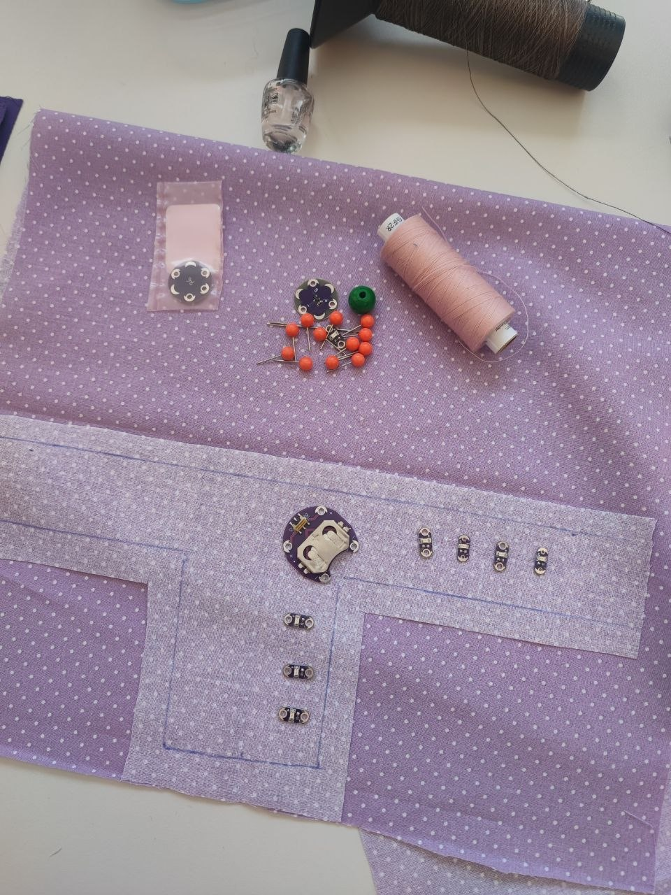
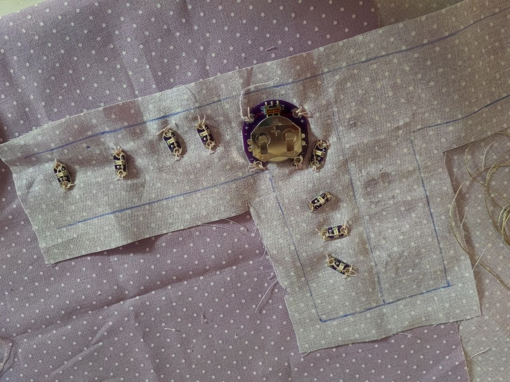
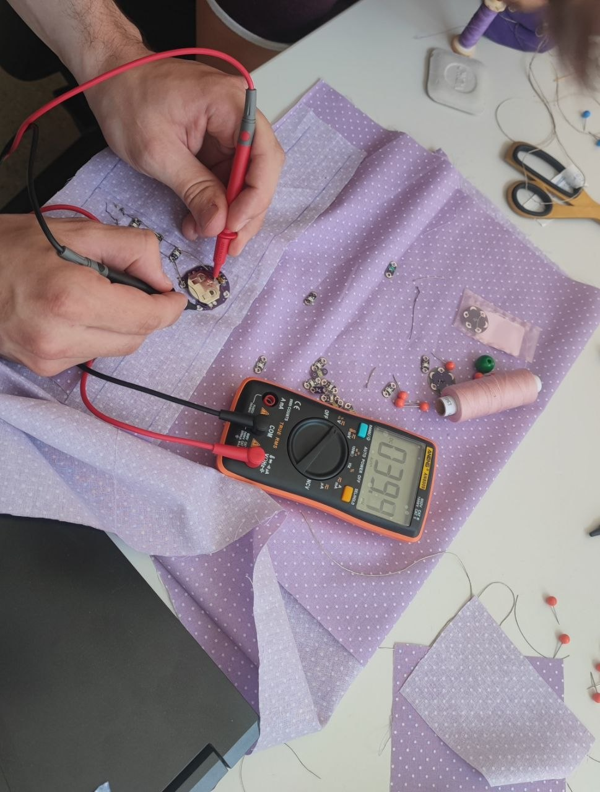
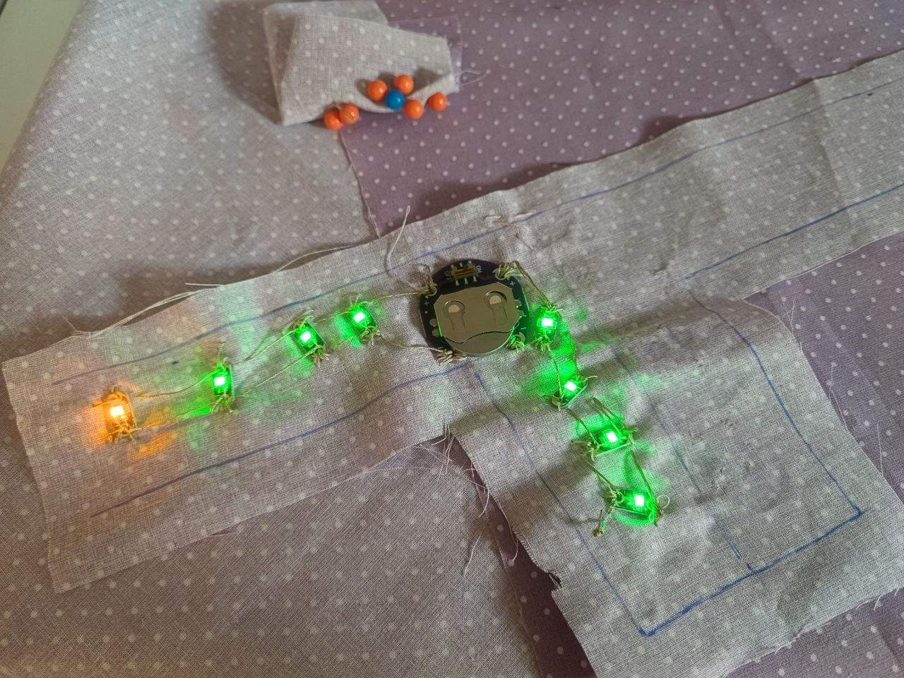
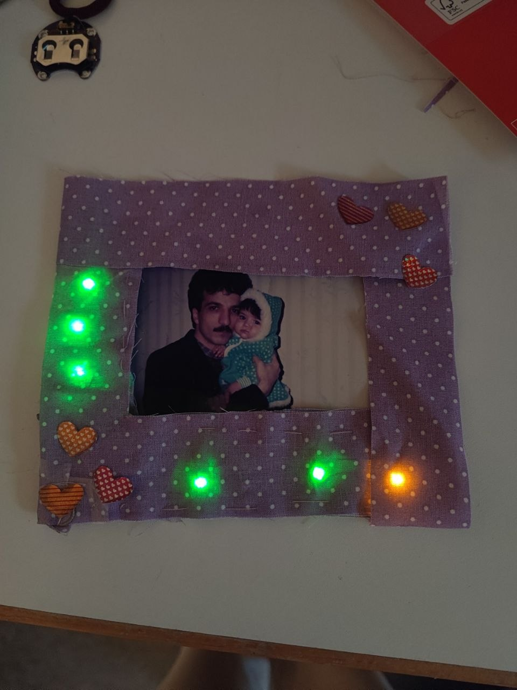

# Digital Design & Fabrication – Exercise 4

# E-Textile Patch: Personalizable Light Patch

**Student:** Fateme Mazaherian  
**Course:** Digital Design & Fabrication  
**University:** Carl von Ossietzky University Oldenburg  
**Lecturers:** Prof. Dr. Susanne Boll-Westermann, Mikołaj Woźniak, Tobias Lunte

---

## Project Overview

The goal of this exercise was to create an e-textile patch that can be attached to clothing while integrating textile materials with simple electronic components.

My initial idea was to create a simple illuminated L-shaped patch using sewable LEDs, conductive thread, and a coin-cell battery. After successfully building and testing the circuit, I transformed the design into a personalizable light patch.

I was inspired by the way many people today express their interests, identities, and group affiliations through wearable accessories. Fans of music groups, sports teams, movies, games, online communities, or personal memories often decorate their belongings with photographs and symbolic images. This patch provides a simple way to display such personal content while adding interactive illumination through embedded LEDs.

The patch allows users to display a photograph or image that is meaningful to them. It can be attached to clothing, jackets, backpacks, tote bags, or other textile accessories.

The final artifact combines textile crafting, basic electronics, and personal customization in a wearable form.

  

---

## Materials

The materials used for this project included fabric, conductive thread, regular sewing thread, sewable LEDs, a battery holder, a CR2032 battery, needles, sewing pins, a photograph, and a multimeter.

  

---

## Choosing the Conductive Thread

Before sewing the circuit, different types of conductive thread were examined and tested.

Initially, I sewed the circuit using a dark gray conductive thread. Although the thread was technically conductive, its electrical resistance was relatively high. After completing the circuit and testing it, the LEDs failed to light up because the coin-cell battery could not provide sufficient current through the thread.

This experience demonstrated that conductivity alone is not enough for e-textile projects; the electrical resistance of the conductive thread also plays a critical role in circuit performance. After further testing and comparison with other conductive threads available in the class, it was concluded that this particular thread was not suitable for projects of this type. As a result, the thread was removed from the class materials and is no longer recommended for future e-textile projects.

  

---

## Initial Design

The project started with a simple L-shaped LED arrangement. The shape provided enough space for multiple LEDs while keeping the circuit relatively simple and easy to sew. 

  

---

## LED Placement

The LEDs were positioned along the vertical and horizontal sections of the design. Their orientation was carefully chosen to simplify the conductive connections and reduce the risk of short circuits.

All LEDs were arranged so that their positive terminals faced outward while their negative terminals faced inward. This consistent orientation made it easier to sew separate conductive paths for the positive and negative connections without crossing the threads.

Maintaining a clear separation between the positive and negative conductive paths was important to ensure proper current flow through the circuit and to prevent unintended electrical contact between the connections.

  

---

## Sewing the Circuit

The LEDs and battery holder were first secured onto the fabric using regular sewing thread to keep the components in place and stabilize the structure.

Afterward, conductive thread was used only where electrical connections were required to complete the circuit.

Since conductive thread has a higher electrical resistance than traditional wires, a parallel circuit configuration was used. Connecting the LEDs in parallel helped ensure that each LED received sufficient power from the coin-cell battery.

Because conductive thread is relatively expensive, limiting its use to the necessary conductive paths helped reduce material consumption while maintaining reliable electrical connections.

  

---

## Testing and Troubleshooting

After sewing the circuit, I tested the connections and checked whether the LEDs would light up.

Initially, the LEDs did not work correctly. I suspected loose stitches, poor electrical contact, broken conductive paths, or battery-related issues.

To investigate the problem:

- The conductive paths were visually inspected.
- Electrical continuity was measured using a multimeter.
- Different batteries were tested.
- The resistance of the conductive thread was measured.

Eventually, it was discovered that the battery holder itself was faulty. After replacing the battery holder with another one, the circuit immediately started working and all LEDs illuminated correctly.

This experience highlighted the importance of testing every component individually during troubleshooting.

  

---

## Working Circuit

After replacing the battery holder, the LEDs illuminated correctly and the circuit functioned as intended.

  

---

## Design Evolution

Once the circuit was functioning properly, I decided to move beyond the original L-shape and create a more meaningful design.

The illuminated structure was transformed into a customizable display area that can hold photographs, artwork, fan-related images, or other personal designs. This redesign allowed the project to remain an attachable e-textile patch while adding a stronger personal and emotional dimension.

  

---

## Final Result

The final design evolved from a simple illuminated LED patch into a personalizable light patch. Users can place their own image inside the display area and attach the patch to clothing, backpacks, tote bags, jackets, or other textile accessories.

---

## What I Learned

Through this project, I learned:

- How to build simple e-textile circuits using conductive thread.
- How to sew parallel circuits on fabric.
- How resistance affects the performance of textile electronics.
- How to troubleshoot circuits using a multimeter.
- The importance of testing individual components systematically.
- How traditional sewing techniques can be combined with electronic prototyping.
- How a simple technical prototype can evolve into a personalized wearable artifact.

---

## Conclusion

This project began as a simple illuminated LED patch and evolved into a personalizable light patch.

Overall, this project showed me how simple electronic components and textile techniques can be combined to create something both functional and personal. What started as a simple LED circuit eventually became a wearable patch that reflects individual interests and creativity while fulfilling the requirement of an attachable e-textile patch.
