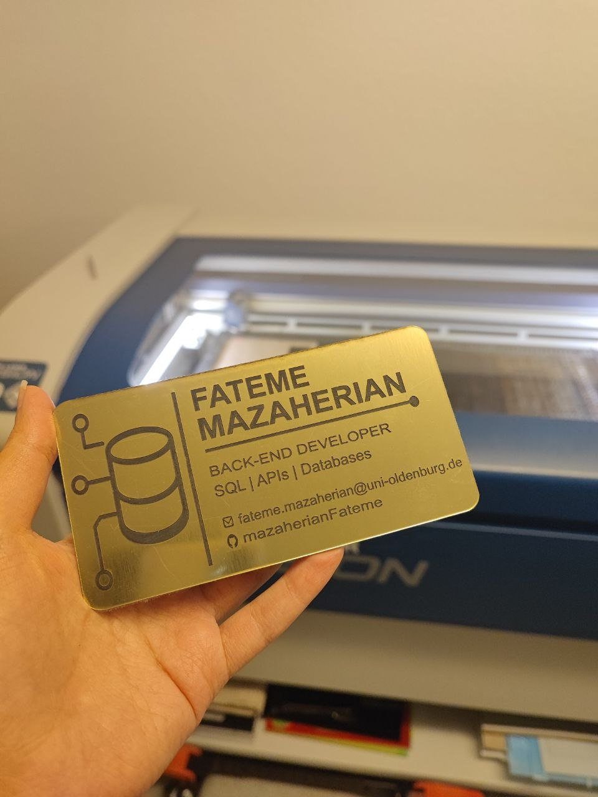
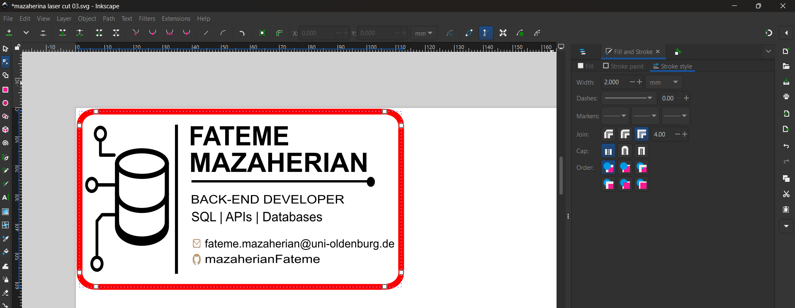
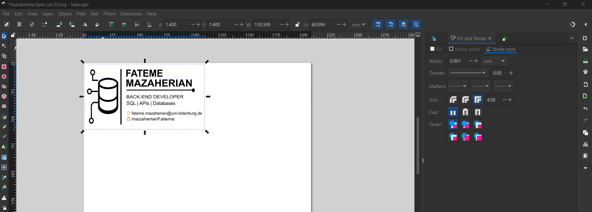
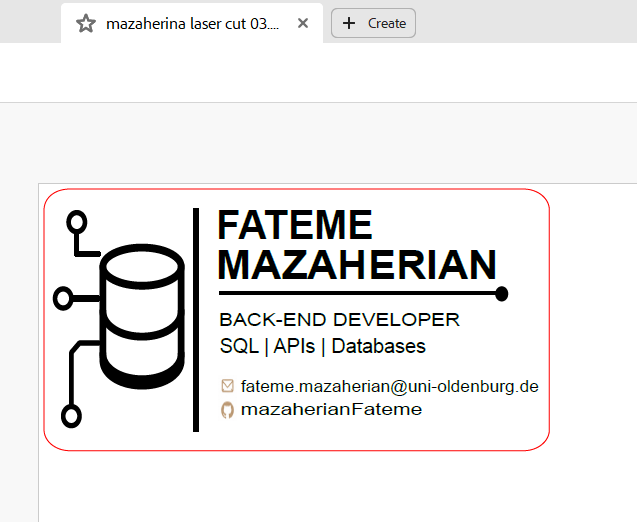
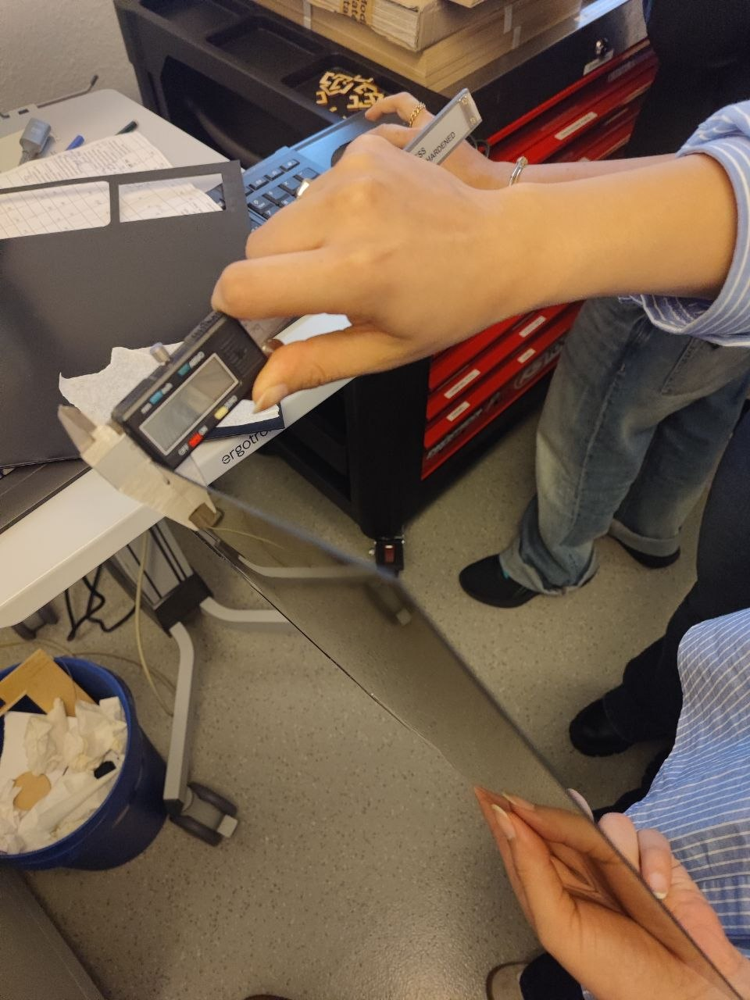
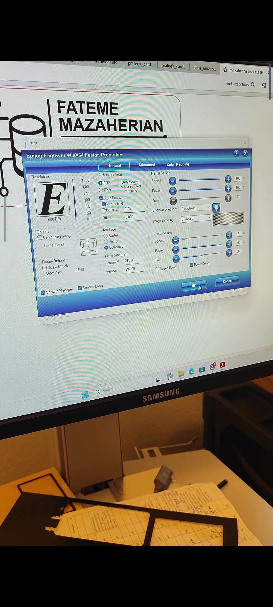

<h1>Digital Design &amp; Fabrication – Exercise 5</h1>

<h2>Business Card</h2>

<strong>Student:</strong> Fateme Mazaherian 
<strong>Course:</strong> Digital Design &amp; Fabrication 
<strong>University:</strong> Carl von Ossietzky University Oldenburg 
<strong>Lecturers:</strong> Prof. Dr. Susanne Boll-Westermann, Mikołaj Woźniak, Tobias Lunte

<h2>Project Overview</h2>

For this exercise, I designed and made my own business card using laser cutting and engraving. I wanted the card to look simple, clean, and professional, but also connected to my background as a Back-End Developer. Because of that, I used a design with a database icon, circuit-like lines, my job title, skills, email address, and GitHub username.

The final card was made from gold acrylic. I chose this material because it gives the card a more elegant and professional look. During this project, I learned how to prepare a vector file for laser cutting, how to adjust the document settings, how to work with cutting lines, and how important the material thickness is for the laser cutter settings.

 

  

<h2>Preparing the Design File</h2>

I first prepared the business card design as a vector file in Inkscape. In the document properties, the page was set to A4 size and portrait orientation. This was important because the file later had to be exported as a PDF and sent to the laser cutter software.

After the design was finished, all text and shapes were converted into objects. This step helped prevent problems with missing fonts or changed text when the file was opened on another computer.

The border around the card was the most important part for cutting. This line was used as the cutting path. In Inkscape, we changed the stroke width of this border to 0.001. The line was almost invisible inside Inkscape, but it was still visible in the exported PDF file. This allowed the laser cutter software to recognize it as a cutting line.

  

  

<h2>Material and Machine Setup</h2>

The material used for this project was gold acrylic. After completing the SVG design, the file was exported as a PDF. Before sending it to the laser cutter, I checked the PDF file to make sure that all elements were displayed correctly and that the cutting border was recognized properly. The business card design was positioned in the upper-left corner of the page to match the placement of the material inside the machine.

  

Before starting the cutting process, the thickness of the acrylic sheet was measured using a digital caliper. The measured thickness was approximately 1.42 mm. This value was important because the laser cutter settings, such as power and speed, depend on the material thickness.

  

After checking the file and the material, we transferred the PDF file to the laser cutter computer using a USB flash drive. Then we checked the laser cutter settings before starting the job.

  

<h2>Laser Engraving and Cutting Process</h2>

The laser cutter first engraved the text and graphic elements onto the surface of the gold acrylic. The database icon, circuit-like lines, contact information, and other details became visible on the material. Because the acrylic was gold, the engraved parts created a nice contrast and the text was easy to read.

[Watch the laser engraving and cutting process video]  <source src="videos/lasercutterProcess.mp4" type="video/mp4">

[Watch the laser engraving and cutting process video](videos/lasercutterProcess%202.mp4)

 
After the engraving was finished, the machine followed the thin outer border and cut the card out of the acrylic sheet. This created the final shape of the business card.

<h2>Result and Reflection</h2>

The final result was close to my original design. The gold acrylic made the card look more professional, and the simple layout helped keep the information clear. The card includes my name, professional title, email address, GitHub username, and technical skills without looking too crowded.

Before this project, I mainly focused on the visual design. However, I realized that preparing the file correctly is just as important as the design itself. Small technical details, such as converting text into objects, checking the document settings, and especially defining the cutting border with a stroke width of 0.001, can have a significant impact on the final result.

I also learned that careful file preparation helps avoid unnecessary material waste. During the laser cutting session, some students were in a hurry to finish their work and did not pay close attention to the cutting border settings. As a result, problems could occur during the cutting process, leading to mistakes and wasted material. This experience showed me that spending a few extra minutes checking the file before cutting is often more efficient than repeating the fabrication process later.

