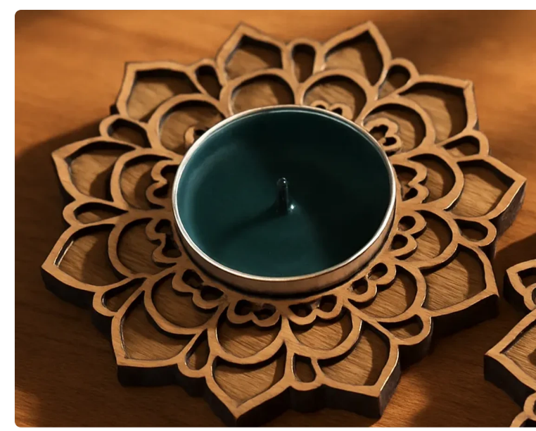
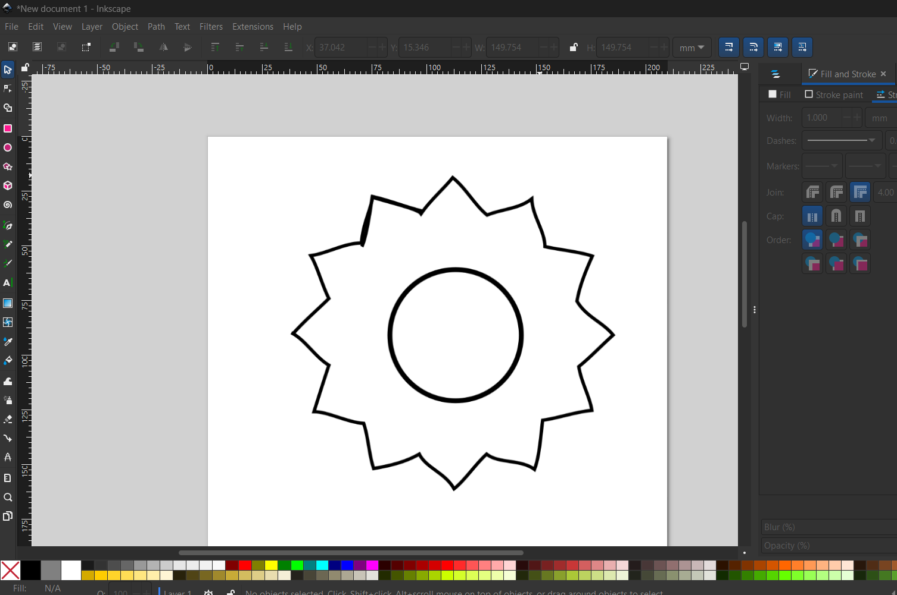
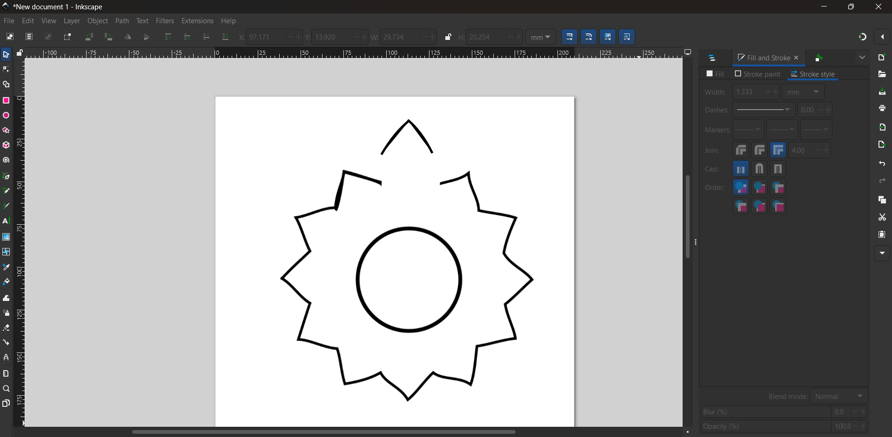
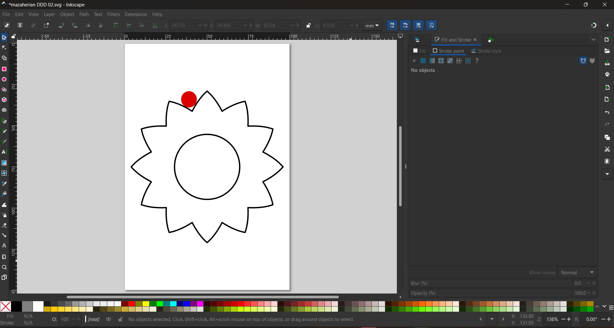
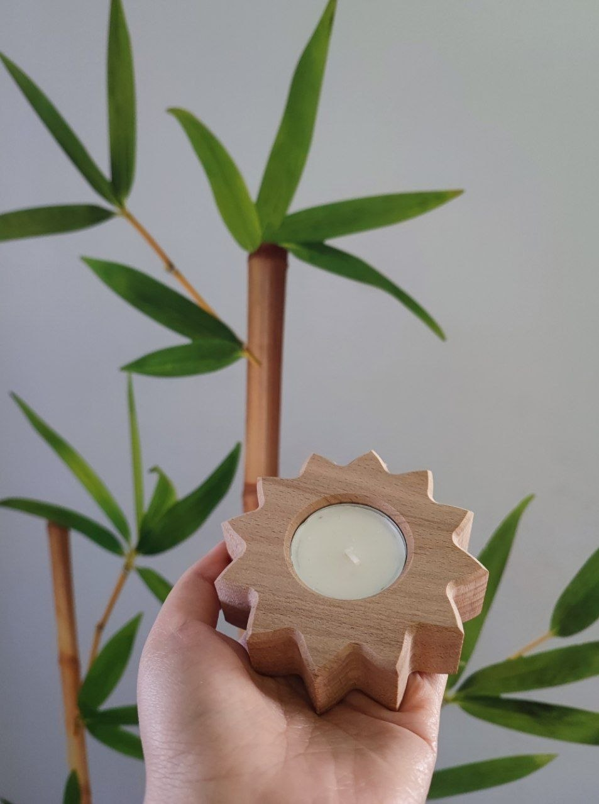

<!DOCTYPE html>
<html lang="en">
<head>
<meta charset="UTF-8">
<title>Designing a Wooden Tea Light Candle Holder</title>

</head>

<body>

<h1>Digital Design &amp; Fabrication – Exercise 7</h1>
<h2>CNC Milling – Wooden Tea Light Candle Holder</h2>

<strong>Student:</strong> Fateme Mazaherian 
<strong>Course:</strong> Digital Design &amp; Fabrication 
<strong>University:</strong> Carl von Ossietzky University Oldenburg 
<strong>Lecturers:</strong> Prof. Dr. Susanne Boll-Westermann, Mikołaj Woźniak, Tobias Lunte

<h2>1. Introduction</h2>

For this exercise, I designed a wooden tea light candle holder using Inkscape.
The aim was to create a vector outline that could later be imported into CAM software for CNC milling.
I wanted the final design to be decorative while remaining simple enough to manufacture with a CNC milling machine.

<h2>2. Idea and Inspiration</h2>

The main inspiration for my design came from a decorative wooden mandala-style candle holder.
I chose this flower pattern because it resembles a lotus flower, which is my mother's favourite flower.
I wanted to create something meaningful that I could later paint and give to her as a handmade gift.

Figure 1. Reference image used as inspiration for the flower-shaped candle holder.

<h2>3. Document Setup</h2>

I created a new document in Inkscape and changed the document units to millimetres.
Following the exercise instructions, I set the page size to <strong>100 mm × 150 mm</strong>.
Working with real dimensions was important because the design would later be manufactured using CNC milling.

<ul>
<li>Software: Inkscape</li>
<li>Units: Millimetres (mm)</li>
<li>Page Size: 100 × 150 mm</li>
<li>Design Type: Vector Outline</li>
<li>Object: Wooden Tea Light Candle Holder</li>
</ul>

<h2>4. Creating the Main Shape</h2>

I started by drawing a simple flower outline using the Pencil Tool.
Then I created the circular opening in the centre where the tea light candle would be placed.
At this stage, the petals were not perfectly identical because everything was drawn manually.

Figure 2. First draft of the flower outline and the central candle opening.

To improve the appearance, I edited the outline using the Node Tool.
By moving and adjusting the nodes, I obtained smoother curves and a cleaner flower shape.

<h2>5. Refining the Design</h2>

After creating one clean petal, I copied and repeated it around the centre of the design.
A single petal was separated from the original path using the Node Tool and the “Break Path at Selected Nodes” command.
The petal was then duplicated using Ctrl + D and rotated repeatedly to form the complete flower pattern.

Using this method ensured that every petal had exactly the same shape, resulting in a more symmetrical and visually balanced design.
It also reduced the amount of manual editing required.

Figure 3. Separating one petal from the original path before duplicating it around the centre.

To verify that the design could be manufactured, I created a red circle with a diameter of <strong>6 mm</strong>.
This circle represented the minimum cutter diameter used to check whether there was enough clearance between neighbouring petals.
If the circle could fit between two petals, there would be sufficient space for the milling tool to pass through.

I also set the outline stroke width to <strong>1 mm</strong> so that the cutting path was clearly visible before exporting the SVG file.

Figure 4. The red 6 mm circle was used to check the clearance between petals.

<h2>6. Adding the Candle Hole</h2>

I created the candle opening using the Ellipse Tool.
Holding the Ctrl key allowed me to draw a perfect circle.
I then set its dimensions to <strong>39.5 mm × 39.5 mm</strong>, which matches the required tea light candle size.

The circle was positioned exactly at the centre of the flower to ensure symmetry and provide sufficient material around the candle opening.

Figure 5. Final flower-shaped tea light candle holder design.

<h2>7. What I Found Important</h2>

This exercise taught me that it is very important to consider the cutter diameter while designing.
Checking the clearance between the petals before machining helps avoid unnecessary material removal, reduces machining time, and ensures that the final product matches the original design.

Another important lesson was that repeating a well-designed component is much more effective than drawing every repeated element manually.
By editing one petal carefully and copying it around the design, I achieved a much cleaner and more professional final result.

<h2>8. Conclusion</h2>

This exercise helped me understand the complete workflow of preparing a vector design for CNC milling using Inkscape.
I learned how to create clean vector paths, edit shapes using the Node Tool, duplicate repeated elements, verify machining clearances, and prepare the design for manufacturing.
The final result is a flower-inspired tea light candle holder that is both decorative and suitable for CNC milling.

<em>Prepared as part of the CNC Milling Exercise using Inkscape.</em>

</body>
</html>
