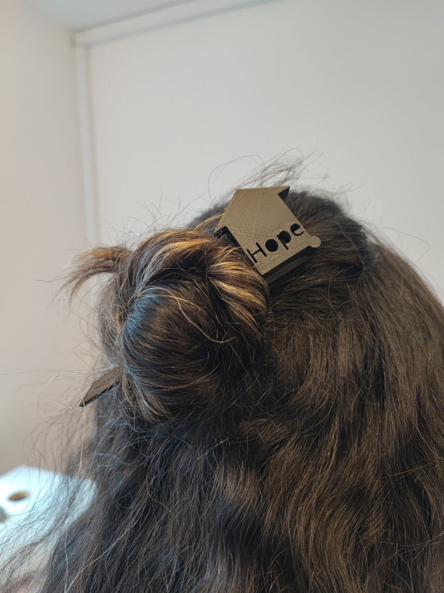
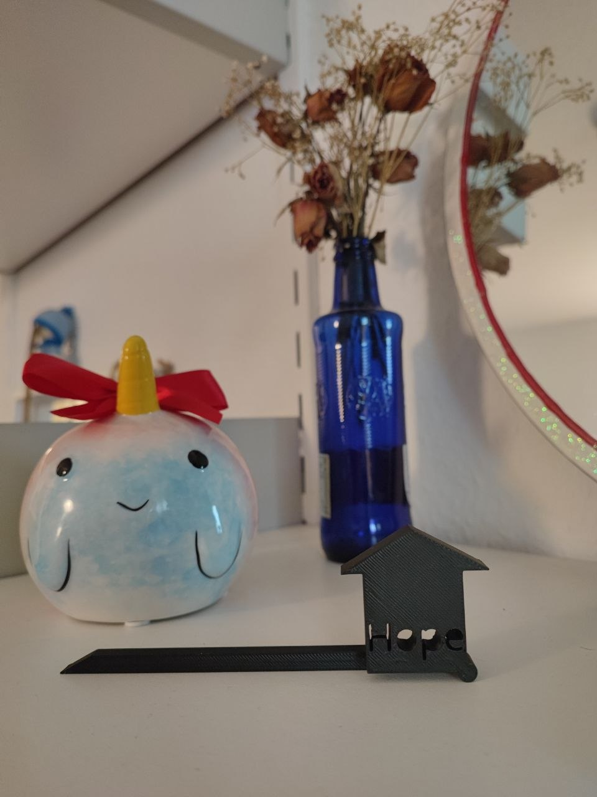

# Digital Design & Fabrication – Exercise 8  
# 3D Printed Hair Accessory

**Student:** Fateme Mazaherian  
**Course:** Digital Design & Fabrication  
**University:** Carl von Ossietzky University Oldenburg  
**Lecturers:** Prof. Dr. Susanne Boll-Westermann, Mikołaj Woźniak, Tobias Lunte  

---

## Introduction

For this exercise, I designed and created a personalized 3D printed hair accessory inspired by traditional Kanzashi-style hair sticks.

The goal of this project was to turn a simple everyday object into a functional 3D printed product. I wanted to design something that I could actually use, while also learning how to work with parametric CAD modelling, prepare a model for printing, and understand the connection between design decisions and fabrication results.

This project was also my first experience using Onshape for a complete 3D design process. Because of that, the exercise was not only about the final object, but also about understanding how sketches, dimensions, constraints, extrusion, and slicing work together.

  
  

---

## Motivation and Concept

I chose to design a hair accessory because it is something I actually use in my daily life. I already owned a similar wooden hair stick and enjoyed using it, but since I live in Germany, where the weather can be quite humid, wood is not always practical for everyday use.

Hair accessories are directly in contact with hair, so they need to be cleaned regularly. However, wood absorbs moisture and needs a long time to dry after washing. Over time, this can damage the material, change its appearance, and even cause mold.

This problem gave me the idea to create my own 3D printed version. I wanted to make something that keeps the same functionality but uses a material that is easier to wash, dries faster, and lasts longer.

Another important point for me was durability. If a model lasts longer, it does not need to be replaced as quickly. For similar objects, this can reduce the need to use and replace wooden versions repeatedly, which means less wood is wasted over time.

For the decorative part, I used a small house shape and added the word **“Hope.”** This concept had a personal meaning for me. While working on this project, I was missing my family and home, so the house became a small symbol of that feeling. The word “Hope” represents my hope of seeing them again soon.

  

  <em>Image 2: Concept sketch or reference idea</em>

---

## Design Process in Onshape

### 1. Creating the Main Stick
I started the model in Onshape by selecting the Top Plane and creating my first sketch. The main part of the accessory was the stick, so I began with a simple rectangular shape and added a pointed triangular tip at one end. The pointed shape helps the accessory slide through the hair more easily.

While creating the sketch, I used dimensions to control the size and constraints to define the relationship between the lines. At first, some parts of the sketch were blue, meaning they were under-defined. After adding the necessary dimensions and constraints, the sketch became black, which showed that it was fully defined.

After finishing the sketch, I used Extrude → Add to give the model thickness and create the first 3D shape.

[Image 3: First sketch of the stick with dimensions]

[Image 4: Extruded stick model]

### 2. Adding the Decorative House Shape
Next, I created the decorative house shape using a rectangle for the body and a triangle for the roof. I placed it directly on top of the stick and made sure the shapes overlapped, so the house and the stick would become one connected printable body.

After completing the sketch, I used Extrude → Add again to merge the house shape with the existing model.

[Image 5: House sketch positioned on the stick]

[Image 6: House after Extrude Add]

### 3. Cleaning the Sketches
During the design process, I had some issues with small gaps, extra lines, and profiles that were not completely closed. Because of this, Onshape could not always recognize the sketch correctly for extrusion.

To fix this, I used the Trim Tool to remove unnecessary lines and clean the geometry. The tutorials were useful here because they helped me understand why clean sketches, closed profiles, and fully defined geometry are important before using tools like Extrude.

[Image 7: Sketch correction / Trim Tool process]

### 4. Adding and Engraving the Text
To personalize the design, I added the word “Hope” to the front surface of the house using the Text Tool. I adjusted the size and position until it fit inside the house shape.

At first, the text caused a problem because some letters were recognized as separate parts. I fixed this by editing the text sketch and checking the Parts list until the model appeared as only Part 1.

After that, I used Extrude → Remove to engrave the word into the surface instead of placing it on top. I also checked the Merge Scope to make sure the cut affected the main body and did not create separate parts.

[Image 8: Adding Hope text sketch]

[Image 9: Fully defined text and Part 1 result]

[Image 10: Extrude Remove settings]

[Image 11: Final engraved Hope design]

---

## Preparing the Model for 3D Printing

Before exporting the model, I checked the final design carefully.

I made sure that:

- the stick and house were connected correctly
- the engraved text was created properly
- unnecessary sketches and imported references were removed
- the final model consisted of only one part

This check was important because a model that is not one connected body can create problems during slicing and printing. If the design is prepared correctly before printing, there is a higher chance of getting a successful result on the first print. This also helps reduce failed prints, wasted filament, and unnecessary material waste.

After checking everything, I exported the model as a:

**STEP file**

and imported it into **QIDI Studio** for slicing.

For printing preparation, I used:

- **Printer:** QIDI Q2
- **Filament:** PLA Rapido
- **Nozzle diameter:** 0.4 mm
- **Layer height:** 0.20 mm Standard profile

I placed the model flat on the print bed because this orientation provided better stability.

After slicing, I checked the preview and noticed that some parts around the house shape required support because of overhanging areas.

To solve this, I enabled:

**Tree Supports**

with:

- **Threshold angle:** 30°
- **Brim width:** 5 mm

The support helped the overhanging areas print correctly, and the brim improved adhesion to the print bed.

Finally, I checked the layer preview, estimated printing time, support structures, and filament usage before saving the final 3MF project file.

  

  <em>Image 12: Model imported into QIDI Studio</em>

  

  <em>Image 13: Support and slicing preview</em>

---

## What I Found Important

One of the most important things I learned during this exercise was that 3D printing does not start at the printer. A successful print starts much earlier, during the design process.

If the sketch is not fully defined, if the profiles are not closed, or if the model is made of separate bodies by mistake, the final print can fail or the slicing process can become more complicated.

I also found it important to check the printing setup carefully. The orientation of the model, the supports, the brim, and the layer preview all affect the final result. Correctly preparing the printing part is important because it increases the chance of getting a good result from the first print. This means less wasted time, less wasted filament, and fewer unnecessary failed prints.

Another important point was material choice. By replacing a wooden accessory with a more washable and durable 3D printed version, the object can last longer and become easier to maintain. For similar models, a longer-lasting design can reduce repeated replacements and therefore reduce material waste.

  

  <em>Image 14: Final slicing preview or print preparation screenshot</em>

---

## Reflection and Conclusion

Overall, this exercise was a much bigger learning process than I expected. Turning an idea into a printable object was not only about creating a nice-looking model; it also had to work technically.

**At first, I thought the difficult part would mainly be designing the shape, but I realized that the technical preparation was just as important. The model had to be clean, connected, and correctly prepared so that it could be printed successfully.**

During this project, I learned how important it is to:

- fully define sketches
- use dimensions and constraints correctly
- create closed sketch profiles
- clean sketches using Trim
- understand the difference between separate parts and one solid body
- use Extrude Add and Extrude Remove correctly
- check the model before sending it to the printer

One important thing I learned is that choosing good reference points from the beginning makes the modelling process easier. Designing around a central reference helps align different sketches and makes connections between parts easier to control.

In the end, I created a personalized hair accessory based on something I already use, while improving the material problem of my old wooden version.

  

  <em>Image 15: Final printed product</em>

  

  <em>Image 16: Final object in use</em>

